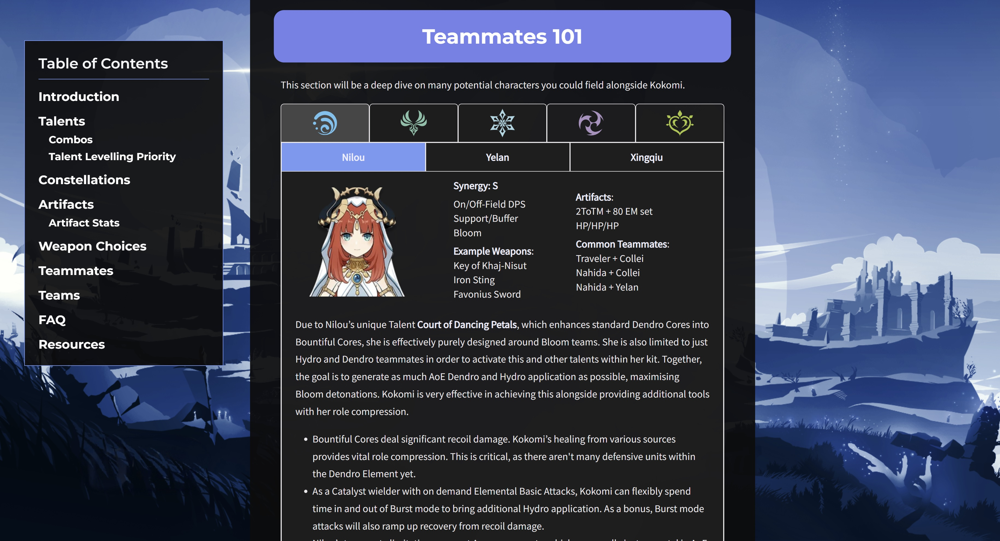
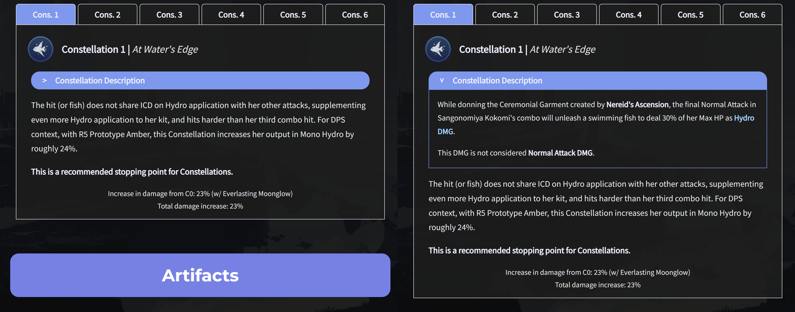
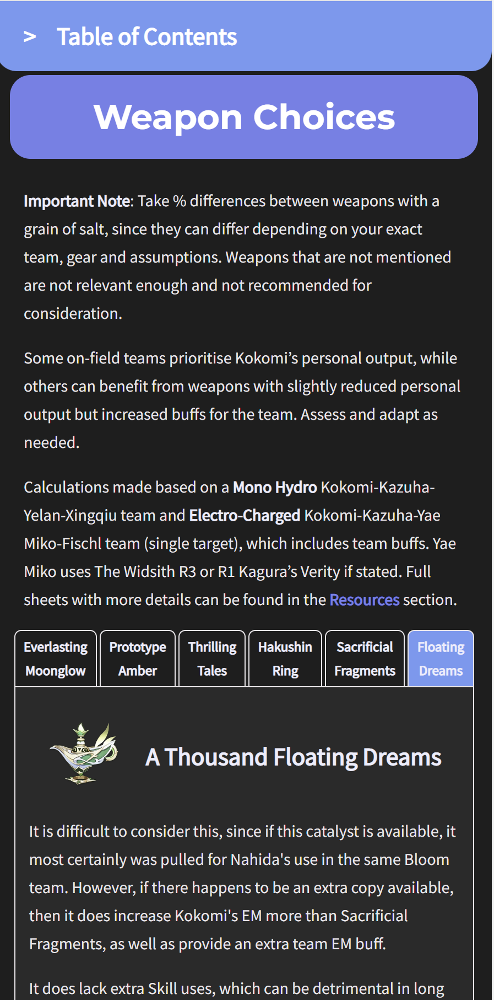

# Character Guider

This is a Kokomi character guide for Genshin Impact 

## Table of contents

- [Overview](#overview)
  - [The challenge](#the-challenge)
  - [Screenshot](#screenshot)
  - [Links](#links)
- [My process](#my-process)
  - [Built with](#built-with)
  - [What I learned](#what-i-learned)
  - [Continued development](#continued-development)
- [Author](#author)


## Overview

### The challenge

Set goals for the application:

- Convert a 60 page long guide into an interactive web-site
- Easy to navigate, responsive
- Condense large amounts of data into reasonably sized elements
- Adjusted for mobile usage

### Screenshot
Tables to condense large amounts of information



Animated, expandable elements




Mobile interface




### Links

- Live Site URL: [Github](https://mkab2000.github.io/kokomi/)

## My process

### Built with

- Semantic HTML5 markup
- CSS custom properties
- Flexbox
- Grid

### What I learned

Grid's incredible functionality
```html
<div class="text table" id="talents">
    <div class="table-name talents-name interactive" id="talents-name0" name="first"><b>Normal Attack</b></div>
    <div class="table-name talents-name interactive" id="talents-name1"><b>Elemental Skill</b></div>
    <div class="table-name talents-name interactive" id="talents-name2"><b>Elemental Burst</b></div>
    <div class="table-name talents-name interactive" id="talents-name3"><b>Ascension 1 Passive</b></div>
    <div class="table-name talents-name interactive" id="talents-name4"><b>Ascension 4 Passive</b></div>
    <div class="table-name talents-name interactive" id="talents-name5"><b>Unique Passive</b></div>

    <div class="table-item talents-item" id="talents-item0">
        ...
    </div>
    <div class="table-item talents-item" id="talents-item1">
        ...
    </div>
    <div class="table-item talents-item" id="talents-item2">
        ...
    </div>
    <div class="table-item talents-item" id="talents-item3">
        ...
    </div>
    <div class="table-item talents-item" id="talents-item4">
        ...
    </div>
    <div class="table-item talents-item" id="talents-item5">
        ...
    </div>
</div>
```

Meanwhile, in CSS, all the table heads stand atop, whilst all the table item elements are assigned to the same to the same grid area. Normally, this would make them all overlap, but by hiding all but one, it is possible to achieve a table with several table heads, pressing each one of which makes a corresponding item to appear.
```css
#talents .table-item {
    grid-area: talents-item;
}
#talents {
    display: grid;
    grid-template-areas: 
        '. . . . . .'
        'talents-item talents-item talents-item talents-item talents-item talents-item';
}
```
### Continued development

Will redo the web-site in its entirety using React to condense the code to a reasonable state

## Author

- Website - [miraskab](https://github.com/mkab2000)
